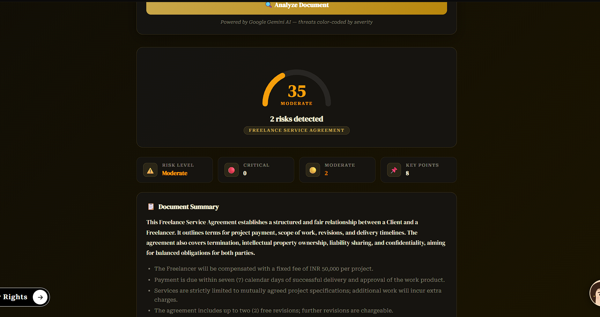
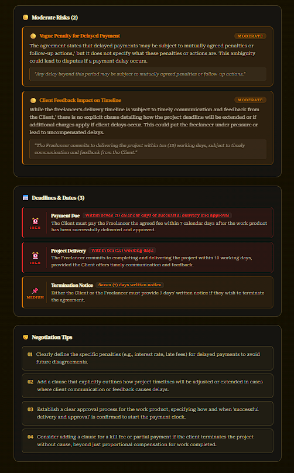
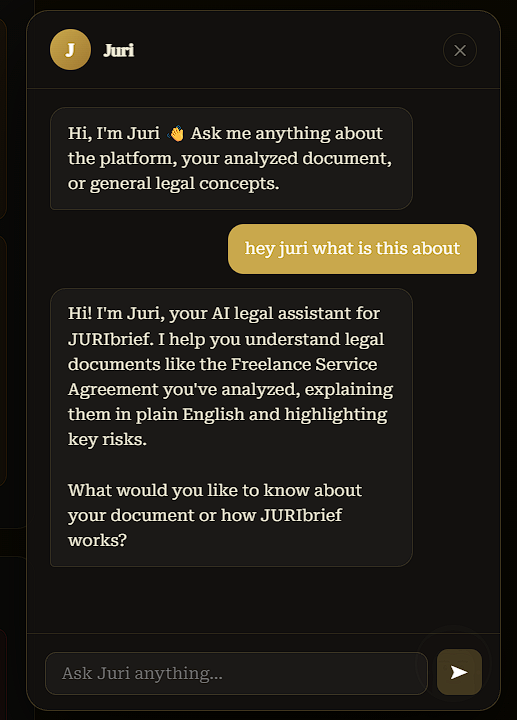
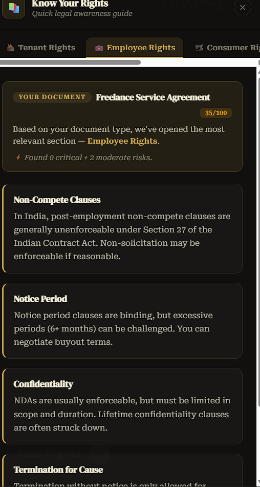

# ⚖️ JURIbrief

> **Understand legal documents before they become legal problems.**

**JURIbrief** is an AI-powered legal document assistant designed to make complex legal documents easier to understand, review, compare, and work with.

Instead of reading a long agreement line by line without knowing what matters, JURIbrief turns a document into a structured overview containing its **summary, important clauses, risks, key points, deadlines, and negotiation considerations**.

It also includes **Juri**, an AI legal assistant that can answer questions about the platform and the document currently being analyzed.

> ⚠️ **Disclaimer:** JURIbrief provides AI-generated information for educational and informational purposes only. It does **not** constitute legal advice and should not replace advice from a qualified legal professional.

---

## ✨ What JURIbrief Does

JURIbrief is built around a simple idea:

**Upload → Understand → Review → Act Carefully**

### 📄 1. Analyze Legal Documents

Upload a legal document and JURIbrief analyzes its contents to produce a structured result.

The analysis can surface:

- 📋 Document summary
- ⚠️ Overall risk level
- 🚨 Critical and moderate risks
- 📌 Key points
- 📅 Important dates and deadlines
- 📝 Clause-level explanations
- 💡 Negotiation suggestions
- 🔎 Areas that may deserve closer review

The goal is not simply to shorten a document, but to make the **important parts easier to find and understand**.

---

### ✍️ 2. Analyze Pasted Text

You can also work with legal text directly instead of uploading a file.

This is useful when:

- You only have a section of an agreement.
- You want to quickly test a clause.
- The document is available as text.
- You want to analyze a specific piece of legal content.

---

### 🔄 3. Compare Two Documents

JURIbrief includes a document comparison workflow for agreements that have multiple versions.

You can compare two versions to understand:

- What changed
- What was added
- What was removed
- Which clauses were modified
- Whether the changes introduce new concerns
- What may deserve negotiation or review

This is especially useful when reviewing revised contracts.

---

### 📝 4. Generate Legal Document Drafts

The **Generate** feature lets you describe the document you need in simple language.

For example:

> `Write me a rent agreement document`

JURIbrief can turn that requirement into a structured legal-document draft that can then be reviewed and edited.

Possible use cases include:

- Rent agreements
- NDAs
- Service agreements
- Basic business agreements
- Other structured legal-document drafts

Generated documents should always be reviewed carefully before being used or signed.

---

### 💬 5. Ask Juri

**Juri** is the AI legal assistant built into JURIbrief.

You can ask questions such as:

- What is this document about?
- What does this clause mean?
- What are the major risks?
- What should I look at before signing?
- Explain this in simple English.
- What are the important dates?

Juri can use the context of the analyzed document to make its explanations more relevant.

---

### 🌍 6. Language Support

JURIbrief includes language selection so users can work with the platform and legal explanations in supported languages.

The goal is to make legal information more accessible without requiring users to understand complicated legal terminology first.

---

### ⚖️ 7. Your Rights Guide

JURIbrief includes a built-in **Your Rights** guide for quick legal-awareness reference.

It covers practical ideas such as:

1. **Understand Before You Sign**
2. **Know What You Are Agreeing To**
3. **Watch for Restrictions**
4. **Protect Your Work**
5. **Keep Track of Time**
6. **Ask When Something Is Unclear**

The guide is intended as general legal awareness, not case-specific legal advice.

---

## 🖥️ Interface Preview

### Document Analysis

The analysis dashboard presents the overall risk score, detected risks, key points, and document summary in one place.



---

### Risk & Deadline Analysis

JURIbrief separates important findings into areas such as **moderate risks, deadlines & dates, and negotiation tips**, making the output easier to scan.



---

### Juri — AI Legal Assistant

The built-in Juri chat allows users to ask questions about the platform and their analyzed document.



---

### Your Rights

The Your Rights section provides a quick legal-awareness guide alongside the main document workflow.



---

### Contact & Creator

The application includes a contact section and creator links for GitHub, LinkedIn, and Instagram.


---

## 🧠 How It Works

At a high level, JURIbrief follows this workflow:

```text
                    ┌───────────────────┐
                    │       User        │
                    └─────────┬─────────┘
                              │
                  Upload / Paste / Generate
                              │
                              ▼
                    ┌───────────────────┐
                    │  React Frontend   │
                    │      + Vite       │
                    └─────────┬─────────┘
                              │
                         API Requests
                              │
                              ▼
                    ┌───────────────────┐
                    │  Express Backend  │
                    └─────────┬─────────┘
                              │
              ┌───────────────┼────────────────┐
              │               │                │
              ▼               ▼                ▼
        Document/PDF       Gemini AI        Database
          Processing        Analysis       / Supabase
              │               │                │
              └───────────────┼────────────────┘
                              │
                              ▼
                    ┌───────────────────┐
                    │ Structured Result │
                    │ Summary • Risks   │
                    │ Dates • Insights  │
                    └───────────────────┘
```

---

## 🏗️ Technology Stack

### Frontend

- **React**
- **Vite**
- **React Router**
- **Tailwind CSS**
- **Framer Motion**
- **Supabase JS Client**
- **Axios**

### Backend

- **Node.js**
- **Express**
- **PostgreSQL**
- **Supabase**
- **Multer** for file uploads
- **PDF.js / pdf-parse** for document processing
- **Mammoth** for document processing
- **Axios** for external API communication

### AI

- **Google Gemini API**

Gemini is used for document analysis, explanations, risk identification, generation, and the Juri assistant workflow.

### Authentication & Data

- **Supabase Auth**
- **Supabase/PostgreSQL**
- Role-based access for administrative functionality
- Protected application routes

---

## 📁 Project Structure

```text
legal-ease-ai-avinash/
│
├── Backend/
│   ├── controllers/
│   │   ├── chatController.js
│   │   ├── compareController.js
│   │   ├── generateController.js
│   │   └── uploadController.js
│   │
│   ├── db/
│   │   ├── db.js
│   │   └── supabaseClient.js
│   │
│   ├── middleware/
│   ├── routes/
│   │   ├── chatRoutes.js
│   │   ├── contactRoutes.js
│   │   ├── uploadRoutes.js
│   │   ├── userRoutes.js
│   │   └── waitlistRoutes.js
│   │
│   ├── server.js
│   ├── package.json
│   └── .env
│
├── client/
│   ├── src/
│   │   ├── components/
│   │   ├── context/
│   │   ├── lib/
│   │   └── pages/
│   │
│   ├── index.html
│   ├── package.json
│   └── vite.config.*
│
├── screenshots/
│   └── README screenshots
│
└── README.md
```

> The `.env` files are intentionally not documented with real values. Never commit API keys, database credentials, service-role keys, or other secrets.

---

## 🚀 Getting Started

### Prerequisites

Make sure you have:

- **Node.js** installed
- **npm** installed
- A **Supabase project**
- A **Google Gemini API key**
- PostgreSQL/Supabase database configuration

---

### 1. Clone the Repository

```bash
git clone https://github.com/AVINASHTIWARI14/legal-ease-ai.git
cd legal-ease-ai
```

---

### 2. Install Frontend Dependencies

```bash
cd client
npm install
```

Start the frontend development server:

```bash
npm run dev
```

Vite will display the local development URL in the terminal.

---

### 3. Install Backend Dependencies

Open another terminal:

```bash
cd Backend
npm install
```

Start the backend:

```bash
node server.js
```

The backend is configured to run on port **5001** in the current application setup.

---

## 🔐 Environment Variables

### Backend

Create:

```text
Backend/.env
```

Add the required server-side configuration:

```env
DATABASE_URL=your_database_connection_string
SUPABASE_URL=your_supabase_url
SUPABASE_SERVICE_ROLE_KEY=your_service_role_key

GEMINI_API_KEY=your_gemini_api_key
GEMINI_MODEL=your_gemini_model
GEMINI_FALLBACK_MODELS=your_fallback_models
```

### Frontend

Create:

```text
client/.env
```

Add:

```env
VITE_SUPABASE_URL=your_supabase_url
VITE_SUPABASE_ANON_KEY=your_supabase_anon_key
```

### ⚠️ Security

**Never commit `.env` files to GitHub.**

In particular, never expose:

- `SUPABASE_SERVICE_ROLE_KEY`
- Gemini API keys
- Database passwords
- OAuth client secrets
- Any production credentials

If a secret has ever been exposed publicly, rotate it before production deployment.

---

## 🔑 Authentication

JURIbrief uses **Supabase Authentication**.

The application supports the account/session workflow through Supabase Auth, including:

- Email/password authentication
- Registration
- Password reset
- Protected routes
- User profiles
- Admin access control

Google authentication is prepared in the application and requires the corresponding OAuth provider configuration before production use.

---

## 🗄️ Data Layer

The application uses Supabase/PostgreSQL for persistent application data.

The project includes database-backed functionality for areas such as:

- User profiles
- Uploaded/document history
- Document analyses
- Generated documents
- Chat history
- Risk clauses
- Contact messages
- Waitlist data

Row-level security and application-level authorization should be reviewed carefully before production deployment.

---

## 🔌 Core Backend Workflows

The frontend communicates with the Express backend through API routes for operations including:

| Workflow | Endpoint |
|---|---|
| Document upload & analysis | `/api/upload` |
| Text analysis | `/api/analyze-text` |
| Document generation | `/api/generate` |
| Document comparison | `/api/compare` |
| Contact submission | `/api/contact-messages` |

The exact request/response structure is defined by the corresponding frontend and backend controllers.

---

## 🧪 Development

Frontend:

```bash
cd client
npm run dev
```

Frontend production build:

```bash
cd client
npm run build
```

Preview the production frontend locally:

```bash
npm run preview
```

Lint the frontend:

```bash
npm run lint
```

Backend:

```bash
cd Backend
node server.js
```

---

## 🎨 Design Philosophy

JURIbrief intentionally uses a **legal-editorial visual style** rather than a generic SaaS dashboard.

The interface combines:

- Warm parchment/off-white surfaces
- Dark legal-document inspired panels
- Gold accent colors
- Serif typography
- Editorial spacing
- Minimal iconography
- Structured information cards
- Motion used selectively

The branding follows:

**JURI** — formal, editorial, legal identity  
**brief** — handwritten/cursive accent for a more approachable feel

---

## 📌 Important Product Principles

### 1. AI assists — it does not replace a lawyer

AI output can contain mistakes, omissions, or incorrect interpretations.

### 2. Users should review important clauses

Risk flags and summaries are intended to help users identify areas that deserve attention.

### 3. Generated documents require review

A generated document should be treated as a draft until reviewed and adapted to the user's actual circumstances.

### 4. Legal jurisdiction matters

Legal rules can vary by jurisdiction and can change over time.

### 5. Privacy matters

Legal documents can contain highly sensitive information. Production deployment should use secure storage, access controls, appropriate retention policies, and properly configured environment secrets.

---


## 👨‍💻 Creator

**Avinash Tiwari**

JURIbrief is a project focused on making legal documents more understandable and accessible through AI-assisted analysis.

### Connect

- GitHub: https://github.com/AVINASHTIWARI14
- LinkedIn: https://www.linkedin.com/in/avinash-tiwari-95b5932a6
- Instagram: https://www.instagram.com/vesper.commw/

---

## 📄 License

This project is currently presented as a personal/project application.


---

## ⚖️ Disclaimer

**JURIbrief is an AI-assisted legal document understanding tool. It is not a law firm, lawyer, or substitute for professional legal advice.**

Always verify important information and consult a qualified legal professional when making legal decisions.
